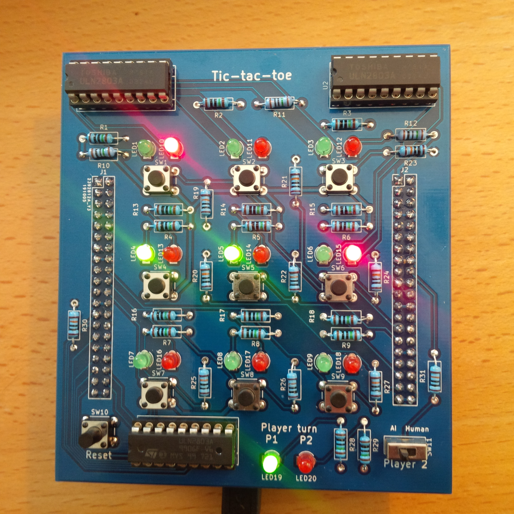

# Tic Tac Toe game for ice40 FPGA (HX8K)

* Simple tic-tac-toe game for the HX8K FPGA breakout board.

* Can both be played against AI or with 2 human players by setting a switch.

* The AI is based on generating the gametree using the python script and then storing all moves in the BRAM of the FPGA as a ROM. The python script generates the entire BRAM block initialization code.

* A PCB design is also provided that can plug directly into the HX8K breakout board. 

* To support other FPGA's you will have to modify the tictactoe_ram entity to fit other native BRAM types.

